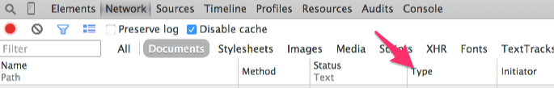

# Learning Objectives

Define JSON
Compare JSON to other datatypes in Ruby
Explain what datatype JSON is *represented*
Explain what datatype JSON *resembles*

## Randomuser.me

We're going to use your Chrome Developer Tools Network tab to do some investigating.  Open it with `Option + Command + i` and click on the "Network" tab

We're interested in the "Type" column.

Visit https://randomuser.me/

Next visit http://api.randomuser.me

1. What Ruby data type does the response from http://api.randomuser.me *resemble*?
hash made up of strings

Now check the Network tab.  You may need to refresh the page to have the network tab record the page visit.

1. What Response Type is recorded when you visit `https://randomuser.me/` ?
text/html
1. What type is recorded when you visit `http://api.randomuser.me`?
application/json
Check the randomuser.me [documentation](https://randomuser.me/documentation#results).

1.  Construct a URL to get back 25 results.
http://api.randomuser.me/?results=25

1.  Construct a URL to get back a man.
http://api.randomuser.me/?gender=male

1.  Construct a URL to get back 25 women.
http://api.randomuser.me/?gender=female&results=25

## Dealing with JSON

1. Find the Ruby documentation for JavaScript Object Notation
http://www.ruby-doc.org/stdlib-2.0/libdoc/json/rdoc/JSON.html

1. What method converts JSON into usable code in Ruby?

require 'json'
my_hash = JSON.parse('{"hello": "goodbye"}')
puts my_hash["hello"] => "goodbye"

1. What methods convert data to JSON?

require 'json'

my_hash = {:hello => "goodbye"}
puts JSON.generate(my_hash) => "{\"hello\":\"goodbye\"}"

Create a new Ruby file called `randomusers` and do the following

1. Paste in your results from http://api.randomuser.me/. Assign it to a string called `results` and use Ruby's JSON library to parse them.

1. Collect all your results names into an Array called `usernames`

1.  Collect all your results thumbnail images into an Array called `thumbnails`
